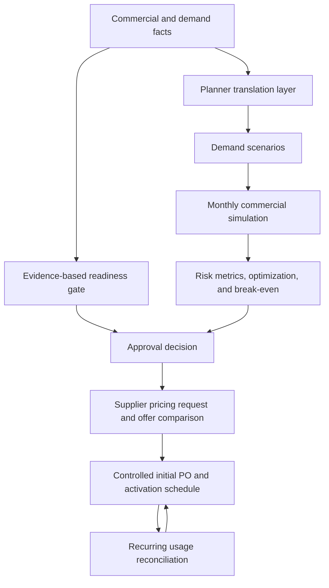

# Architecture

## Design goal

The optimizer is deliberately small, inspectable, and deterministic when given the same
seed. A sourcing analyst should be able to trace a result from evidence, through an
assumption, into a monthly cash flow and an optimization decision.



`planner.py` is the product-facing translation layer. It maps total demand, day-one
need, unit price, contract term, rollout completion, confidence, and risk posture into
the typed model configuration. It also converts the selected policy back into a review
schedule and procurement memo. The numerical engine remains independent of Streamlit.

`readiness.py` deliberately sits above the optimizer. It applies non-compensating gates:
strong scores on easy checks cannot cancel an unconfirmed architecture, demand, delivery,
dependency, or required-pilot condition. `quotes.py` evaluates supplier-entered terms on
the same scenario set. `monitoring.py` converts post-award usage into an operational
contract action.

## 1. Readiness and approval gate

The readiness layer accepts documented statuses for demand, technical capacity,
implementation planning, critical dependencies, usage reporting, and pilot completion.
It also checks whether phased pricing was requested and whether a recurring usage owner
was assigned.

The gate returns a hold, phased-with-conditions, or ready-for-comparison decision plus
plain-language blockers and record gaps. It does not change the optimizer's numerical
answer; it controls whether that answer can be treated as an approvable PO quantity.

## 2. Evidence boundary and case loader

`case_loader.py` reads a JSON case into typed, immutable models. The Toronto package uses
three evidence classes:

| Evidence class | Meaning | Example |
|---|---|---|
| `published_audit` | Directly reported by an official public source | 7.5% M365 deployment at the end of Year 1 |
| `derived_from_published_audit` | Transparent arithmetic from a published figure | CAD 14.28 per licence-equivalent month |
| `illustrative_counterfactual` | A user-controlled scenario, not an observed term | 15% premium for quarterly activation |

The distinction matters because a counterfactual can illuminate a decision without
pretending to reconstruct a confidential contract.

## 3. Adoption forecast

`forecast.py` creates a monotonic logistic adoption curve and normalizes it so that:

- month zero equals the configured active population;
- the configured rollout-completion month reaches the scenario-specific demand target;
- demand holds at that target after rollout completion; and
- adoption never falls between months.

Legacy case files that do not specify a rollout-completion month retain the original
behavior and reach their target at the end of the model horizon.

For each Monte Carlo path, the engine independently varies:

- ultimate demand using a normal multiplier;
- rollout speed using a normal multiplier; and
- rollout delay using a Bernoulli event followed by a triangular delay distribution.

The triangular distribution is useful when a project team can estimate the earliest,
most likely, and latest delay but does not have enough historical data to fit a richer
distribution. The random-number generator is seeded for reproducibility.

## 4. Commercial-option model

`models.py` defines a `CommercialOption`. Each option supports:

- one or more volume-price tiers;
- initial commitment as a share of planned target;
- a hard minimum-commitment floor;
- monthly, quarterly, semiannual, annual, or other review cadence;
- true-up-only or true-up/true-down behavior;
- a capacity buffer above active demand at review;
- emergency-overage pricing;
- a price multiplier representing the cost of flexibility;
- one-time and monthly fixed fees; and
- annual escalation.

Terms are expressed as data rather than code so analysts can replace illustrative inputs
with actual supplier bids.

## 5. Monthly pricing engine

`pricing.py` evaluates one demand path month by month.

At inception:

```text
commitment = max(minimum floor, planned target × initial commitment percentage)
```

At each review date:

```text
requested capacity = active demand × (1 + buffer)
```

A true-up-only policy can increase but not decrease its committed baseline. A true-down
policy can reset the baseline to the requested quantity, subject to its floor. Demand
above commitment between reviews is recorded as overage and billed at the configured
overage multiplier.

For month `t`:

```text
monthly cost = commitment × unit price
             + overage units × unit price × overage multiplier
             + fixed monthly fee
```

Unused cost represents committed units above active demand multiplied by their price.
It excludes qualitative value, option value, and bundle benefits that the model cannot
observe.

## 6. Monte Carlo and risk metrics

`simulation.py` applies every commercial option to every demand path. It returns:

- expected and median total cost;
- P90 total cost;
- 90% conditional value at risk (the average of the costliest 10% of paths);
- expected unused and overage costs;
- unused and overage unit-months; and
- expected utilization.

The default decision objective is:

```text
risk-adjusted cost = expected cost
                   + 0.25 × (CVaR90 − expected cost)
```

The 0.25 weight is a policy choice, not a statistical truth. The guided planner maps
plain-language cost-focused, balanced, and conservative postures to documented risk and
overage settings. Programmatic users can still set the numerical values directly.

## 7. Policy optimizer

`optimizer.py` performs an explicit grid search. The default grid tests combinations of:

- 10 initial-commitment percentages;
- four buffer percentages;
- four review frequencies; and
- true-up-only versus true-down.

For the Toronto template, duplicate grid points below the 7.5% floor are skipped, leaving
288 evaluated candidates. More frequent review and true-down rights receive explicit,
editable price premiums.

The default feasibility guardrail rejects any candidate expected to source more than 10%
of consumed unit-months as emergency overage. This prevents a superficially cheap policy
from “winning” by treating ordinary demand as exceptions. The guardrail is visible and
editable because organizations differ in tolerance for compliance and operational risk.

## 8. Break-even analysis

`analysis.py` uses binary search to answer:

> How large could the unit-price premium for the flexible structure become before its
> risk-adjusted cost equals the locked alternative?

This is more useful in negotiation than a point estimate. If a supplier's quoted premium
is below the boundary, flexibility has modeled economic room; if it is above, the buyer
must justify the term using value not captured by the model or choose another structure.

## 9. Supplier-offer comparison

`quotes.py` converts each actual supplier response into the same `CommercialOption`
model used by the optimizer. It regenerates the planner's seeded demand scenarios and
evaluates all offers using the same risk weight and CVaR threshold. The resulting rank
cannot be distorted by giving one supplier a friendlier forecast.

The generated pricing-request CSV asks suppliers for a full commitment, the modelled
phased structure, and a phased structure with true-down. Blank response fields preserve
a like-for-like commercial schedule without inventing supplier prices.

## 10. Post-award usage reconciliation

`monitoring.py` takes a current commitment, active use, inactive assignments, price,
buffer, and true-down permission. It calculates unused units and cost, recommends a
usage-plus-buffer commitment, and returns one of four actions:

- controlled true-up;
- contractual true-down;
- freeze net-new purchases and consume the pool; or
- maintain the aligned commitment.

The calculation does not assume that unused units can be removed when the contract does
not grant that right.

## 11. Reporting and interface

`reporting.py` writes the reproducible case-study bundle. `planner.py` produces the
buyer-facing review schedule and approval memo. `webapp.py` connects planning, supplier
comparison, usage control, Toronto evidence, and the operating guide; `app.py` remains a
stable Streamlit entry point. No result depends on a proprietary API or language model.

The interface puts the recommendation first and keeps CVaR, candidate counts, and other
model diagnostics in an advanced section. The public Toronto evidence remains a separate
tab so modelled counterfactuals are not presented as disclosed contract terms. Exports
carry a notice that outputs are modelled rather than realized.
