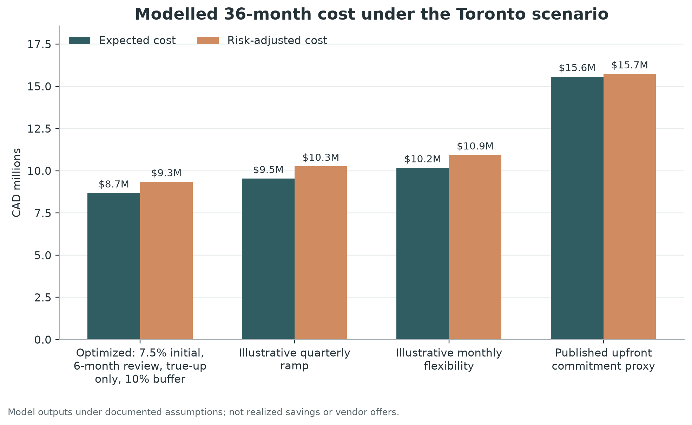

# Methodology and Toronto experiment

## Research question

How should a buyer structure an enterprise-software commitment when the supplier rewards
volume but actual activation depends on a rollout that may be late, slower than expected,
or smaller than forecast?

The experiment does not attempt to recreate the City of Toronto's confidential
negotiation. It uses public audit outcomes to construct a reproducible stress test for a
pre-award decision model.

## Public facts used

The 2024 City of Toronto Auditor General report states that:

- an M365 agreement for 10,000 enterprise users plus two add-ons was described as 30,000
  subscription licences;
- the annual subscription cost was CAD 5,140,800;
- 7.5% had been deployed by the end of the first agreement year, with CAD 4,755,240 in
  reported unused subscription cost; and
- usage was 44.5% during the first nine months of Year 2, with CAD 2,141,357 in reported
  unused subscription cost.

The same audit documented other deployment-linked under-use, including CAD 1,932,376 for
SAP S/4HANA licences and related services during a 16-month delay and CAD 657,177 for
ForgeRock as of September 2024. The 2026 follow-up reported cumulative ForgeRock unused
cost of CAD 2.6 million since project inception. Periods and scopes differ, so these
figures are not summed.

Sources are listed in [`case_studies/toronto/SOURCES.md`](../case_studies/toronto/SOURCES.md).

## Derived baseline

The model derives one cost proxy:

```text
CAD 5,140,800 ÷ 30,000 ÷ 12 = CAD 14.28 per licence-equivalent month
```

Holding 30,000 units for the 12 months at 7.5% utilization reproduces the audit's Year-1
unused cost exactly. This is covered by a regression test.

The proxy is not claimed to be Microsoft's list price, a standalone SKU price, or the
economic allocation used by the City. It is an analytical denominator for the case.

## Readiness-gate reconstruction

The public record supports a prospective control test without using hindsight usage as
an input. The audit states that the network had been estimated to support 6,000 users,
that architecture scalability and performance still required review, and that the
agreement covered an initial 10,000 users. In the application, an unconfirmed technical-
capacity gate blocks approval of the full commitment.

This does not prove what alternative quantity or term was obtainable. It establishes the
decision-process result: the target quantity should not pass an evidence-based gate until
capacity is confirmed or an authorized exception is recorded.

## Retrospective usage-aligned boundary

The case configuration separately records:

- examined M365 subscription spend: CAD 8,996,400;
- audit-reported unused cost: CAD 6,896,597; and
- reported five-year bulk-discount savings: approximately CAD 2,800,000.

For an illustrative flexibility premium `p`, the retrospective tab calculates:

```text
used-cost proxy = examined spend − reported unused cost
phased-cost proxy = used-cost proxy × (1 + p)
upper-bound difference = examined spend − phased-cost proxy
```

The calculation uses observed outcomes and assumes billing could follow observed use.
It is not included in the prospective Monte Carlo results and is not a savings claim.

## Illustrative demand assumptions

| Input | Publication value | Status |
|---|---:|---|
| Horizon | 36 months | Model assumption |
| Planned target | 30,000 licence-equivalent units | Anchored to audit description |
| Initial active units | 2,250 | Derived as 7.5% of 30,000 |
| Rollout midpoint | Month 16 | Model assumption |
| Logistic growth rate | 0.38 | Model assumption |
| Probability of material delay | 45% | Model assumption |
| Delay range | 2 / 6 / 12 months (min/mode/max) | Model assumption |
| Final-demand volatility | 10% | Model assumption |
| Adoption-speed volatility | 15% | Model assumption |
| Simulations | 2,000 | Experiment design |
| Random seed | 20260801 | Reproducibility control |

## Commercial scenarios

### Published upfront commitment proxy

- 30,000-unit minimum;
- CAD 14.28 monthly unit-cost proxy;
- annual true-up and no true-down;
- 10% overage multiplier; and
- no modelled escalation or fees.

Only the cost and initial quantity are anchored to published information. The handling of
demand above 30,000 is a model convention.

### Illustrative quarterly ramp

- 2,250-unit floor;
- 7.5% initial commitment;
- quarterly true-up, no true-down;
- 10% buffer; and
- 15% unit-price premium.

### Illustrative monthly flexibility

- 2,250-unit floor;
- 7.5% initial commitment;
- monthly true-up and true-down;
- 5% buffer; and
- 25% unit-price premium.

These are counterfactual test structures, not supplier quotes.

## Optimization search

The optimizer starts from a 2,250-unit floor and tests 288 non-duplicate policies. The
default flexibility premiums are:

| Review cadence | Modelled premium |
|---:|---:|
| Monthly | 20% |
| Quarterly | 12% |
| Semiannual | 6% |
| Annual | 0% |

True-down adds another 8%. The search rejects policies whose expected overage unit-months
exceed 10% of expected consumed unit-months.

## Results

| Rank | Scenario | Expected cost | P90 cost | Risk-adjusted cost | Expected unused cost |
|---:|---|---:|---:|---:|---:|
| 1 | Optimized: 7.5% initial, 6-month review, true-up only, 10% buffer | CAD 8.68M | CAD 10.84M | CAD 9.35M | CAD 0.39M |
| 2 | Illustrative quarterly ramp | CAD 9.54M | CAD 11.88M | CAD 10.26M | CAD 0.60M |
| 3 | Illustrative monthly flexibility | CAD 10.18M | CAD 12.63M | CAD 10.94M | CAD 0.48M |
| 4 | Published upfront commitment proxy | CAD 15.58M | CAD 15.92M | CAD 15.74M | CAD 7.81M |



The selected policy's expected overage share is 9.0%, just below the 10% feasibility
guardrail. The modelled risk-adjusted difference between the optimized policy and upfront proxy is
CAD 6.39 million. It is not a statement about money Toronto could have recovered. It
depends on assumed alternative rights, prices, demand, and supplier acceptance.

The break-even test found that the optimized structure could carry a unit price about
78.4% above the public cost proxy before matching the upfront proxy's risk-adjusted cost.
The selected candidate itself carries only the configured 6% semiannual-review premium.
The large boundary reflects the amount of overcommitment in this particular simulated
ramp; it is not a general software-market benchmark.

## Validation

Automated tests cover:

- monotonic and bounded demand curves;
- guided rollout completion and post-rollout plateau behavior;
- seeded scenario reproducibility;
- price-tier selection;
- commitment behavior at true-down reviews;
- option ranking and optimizer candidate counts;
- break-even behavior;
- buyer-input translation, procurement scheduling, and memo generation; and
- exact reconciliation of the published M365 Year-1 cost and unused cost;
- non-compensating readiness gates;
- supplier-offer ranking on common scenarios;
- post-award reclaim, freeze, true-up, and true-down actions;
- retrospective counterfactual arithmetic; and
- end-to-end Streamlit plan generation.

The publication outputs are generated by the CLI and charts are generated only from the
checked-in CSV outputs and audit-fact file.

## What would be required for a live sourcing event

Replace the illustrative inputs with:

- actual SKU-level and bundle-level supplier bids;
- minimum annual and total-contract commitments;
- price-protection and indexation clauses;
- retroactive true-up mechanics and deployment-date evidence rules;
- termination, transfer, substitution, and renewal rights;
- a dependency-based implementation schedule;
- scenario probabilities reviewed by delivery owners; and
- hard operational or compliance limits on overage.

Then run sensitivity cases, obtain cross-functional sign-off on assumptions, and keep the
model output alongside the negotiation record.
