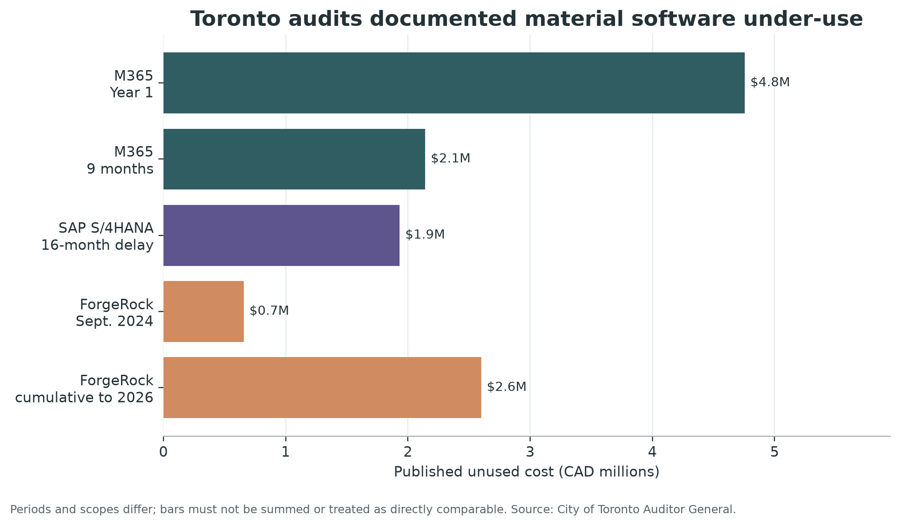
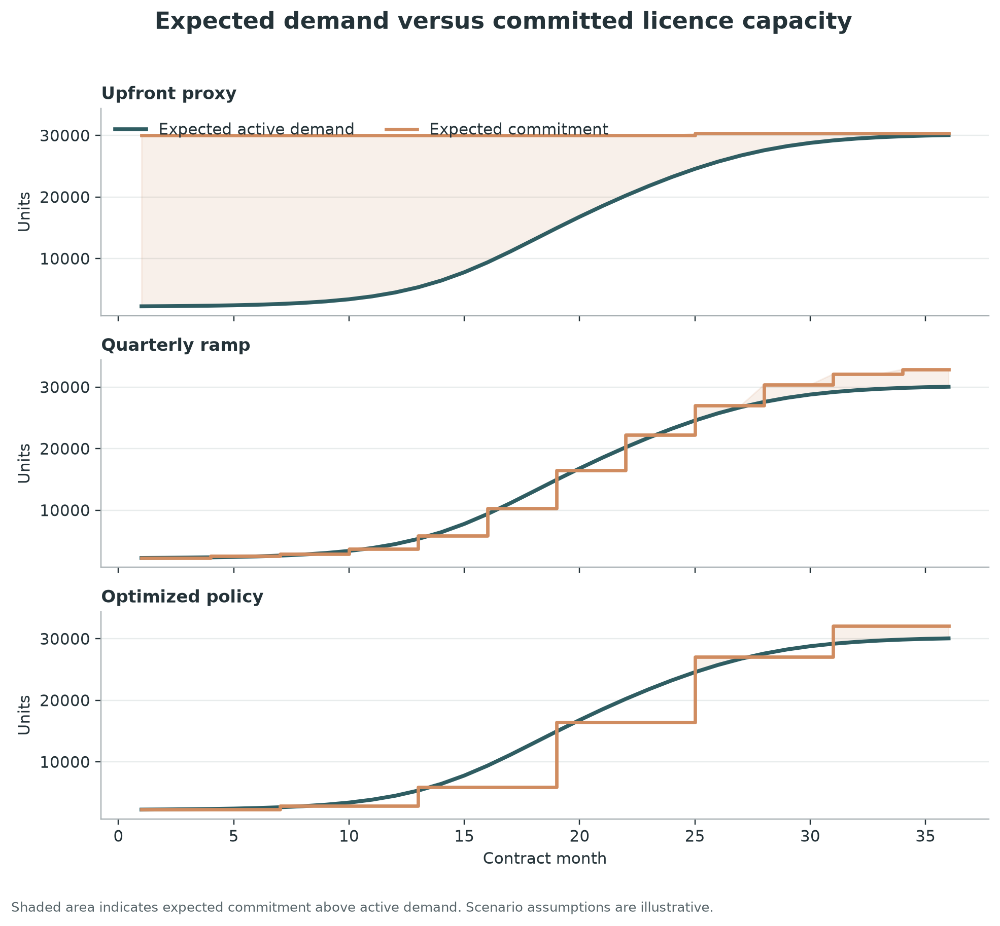

# The Discount Was Real. So Was the Waste.

## I built a risk-adjusted optimizer for software commitments, using the City of Toronto audit as a public test case

*By Arun Balaji Raju*

Enterprise software procurement contains a deceptively difficult sourcing decision:

> How much should a buyer commit before the organization is actually ready to deploy?

Commit more and the supplier may improve the unit price. Commit less and the buyer may
lose volume discounts, budget predictability, or enterprise rights. The commercial
decision is made at signature, but the value appears only if infrastructure,
integrations, security approvals, data, delivery teams, and users become ready on time.

That timing mismatch is not ordinary “shelfware.” Shelfware is usually discovered after
purchase. This is a pre-award sourcing problem: choosing a commitment shape before anyone
knows the final adoption path.

I built an open-source **Software Commitment & Ramp Optimizer** to make that decision
explicit. It models uncertain adoption, applies real commercial mechanics month by month,
tests alternative negotiation policies, measures tail risk, and calculates how much a
buyer could rationally pay for flexibility.

I used a City of Toronto Auditor General report as the public test case because it
contains unusually concrete deployment and cost data. The result is not a claim that the
City could have bought the counterfactual terms, and it is not a retrospective savings
estimate. It is a reproducible experiment showing what a sourcing team could have
quantified before committing.

> **Independence and evidence note:** This project is independent and is not affiliated
> with or endorsed by the City of Toronto, Microsoft, SAP, or ForgeRock. Published audit
> facts are separated from derived values and illustrative model assumptions throughout
> the repository.

---

## The Toronto case: deployment did not match the commitment clock

Toronto's Auditor General published the report
[Audit of Software Acquisition and Licence Management: Managing and Optimizing Value from Software Licences](https://www.toronto.ca/legdocs/mmis/2024/au/bgrd/backgroundfile-251260.pdf)
in December 2024.

For Microsoft 365, the audit described an agreement covering 10,000 enterprise users and
two add-ons as **30,000 subscription licences**. The published annual subscription cost
was **CAD 5,140,800**.

At the end of the first agreement year:

- deployment was **7.5%**; and
- the audit reported **CAD 4,755,240** in unused subscription cost.

During the first nine months of the second year:

- usage was reported at **44.5%**; and
- the audit reported **CAD 2,141,357** in unused subscription cost.

The report also documented related patterns elsewhere in the software portfolio. It
reported **CAD 1,932,376** associated with unused SAP S/4HANA licences and related
services during a 16-month project delay. For ForgeRock, it reported 15,331 of 800,000
purchased units in use as of September 2024 and **CAD 657,177** in unused cost. A
[2026 follow-up report](https://www.toronto.ca/legdocs/mmis/2026/au/bgrd/backgroundfile-288922.pdf)
later reported 45,117 units in use, a contractual purchase of at least 700,000 annually,
and cumulative unused cost of **CAD 2.6 million** since project inception.

Those periods and scopes are different. I do not add them together or treat the bars as
direct comparisons. What they establish is the legitimacy of the problem: software
commercial commitments and implementation readiness can move on different clocks.



There is also an important counterpoint. City management reported volume-discount
savings associated with the M365 agreement. That means the analytical question is not
“Are volume commitments bad?” They are not. The question is:

> At what price does the discount stop compensating for the risk of paying before
> activation?

That is a break-even problem, not a slogan.

---

## What an optimizer could have changed

The audit describes an outcome. A sourcing tool must act earlier.

Before signature, a buyer typically has at least five imperfect inputs:

1. a target population;
2. a deployment plan;
3. known technical and organizational dependencies;
4. supplier pricing for one or more commitment levels; and
5. possible flexibility terms, even if they carry a premium.

The interface does not ask the buyer to translate those facts into Monte Carlo or CVaR
parameters. It asks seven plain-language questions: total need, day-one need, unit price,
contract term, rollout completion, rollout confidence, and planning posture. A
translation layer maps those answers into the numerical model and converts the result
back into a buying schedule and negotiation position.

The buyer rarely knows one “correct” deployment forecast. What it can know is a range:
earliest, most likely, and latest readiness; possible final demand; and how fast adoption
might grow after a delay.

The optimizer converts those uncertainties into thousands of plausible monthly demand
paths. It then prices the same paths under different commercial structures:

- full commitment at commencement;
- phased activation;
- monthly, quarterly, semiannual, or annual review;
- true-up only or true-up and true-down;
- minimum floors;
- operational buffers;
- overage pricing;
- fixed and one-time fees;
- annual escalation; and
- an explicit unit-price premium for flexibility.

Instead of arguing abstractly that a phased ramp “should save money,” the sourcing team
can say:

> With these delivery assumptions and this risk tolerance, semiannual activation remains
> economically preferable up to a unit price of X. Above X, the upfront alternative
> becomes better. Here is the overage exposure and P90 budget for each option.

That is a negotiable position.

---

## The tool, component by component

The code is intentionally transparent. There is no proprietary optimization service and
no language model making hidden commercial judgments.

### 1. Evidence boundary and case loader

The first component prevents a common research error: blending public facts and invented
counterfactuals in the same table.

The Toronto case stores:

- published audit facts in a CSV with page references;
- derived arithmetic with a distinct label;
- simulation assumptions in a JSON configuration; and
- source URLs in a dedicated source note.

Typed models validate every configuration. Negative fees, unsorted price tiers,
impossible delay ranges, and invalid probabilities fail before the simulation begins.

This component does not optimize anything. Its job is epistemic: make it obvious what is
known, calculated, assumed, and user-entered.

### 2. Adoption forecast

The forecast engine builds a smooth logistic rollout between an initial active population
and a final target. It is normalized so that month zero matches the day-one population,
the target is reached at the configured rollout-completion month, and demand holds at
that level for the remainder of the contract.

Each Monte Carlo scenario varies three things:

- **final demand**, because the target population may change;
- **adoption speed**, because rollout can be faster or slower; and
- **delay**, because infrastructure or implementation dependencies may move the adoption
  curve to the right.

Delay uses a triangular distribution. That is deliberately modest. A sourcing team often
cannot estimate a sophisticated distribution but can agree on an earliest, most likely,
and latest delay. The random seed is fixed, so another reviewer can reproduce the same
paths.

### 3. Commercial-term model

A commercial option is a data object, not a hard-coded formula. It contains price tiers,
initial commitment, contractual floor, review cadence, true-down rights, buffer,
overage multiplier, fees, escalation, and flexibility premium.

This makes the model usable in an RFP or negotiation. An analyst can replace illustrative
terms with the actual rows from supplier bids without changing the engine.

### 4. Monthly pricing engine

For every demand path, the pricing engine establishes the initial commitment:

```text
initial commitment = max(contractual floor,
                         target × initial commitment percentage)
```

At each review date, it calculates requested capacity as active demand plus a buffer. A
true-up-only option can increase but cannot reduce the baseline. A true-down option can
move in either direction, subject to the floor.

If demand exceeds commitment between review dates, the excess is recorded as emergency
overage and billed at its configured multiplier. This matters because an optimizer can
otherwise produce a superficially cheap answer by turning normal demand into exceptions.

The engine produces a monthly cash flow, unused capacity, unused cost, overage units,
overage cost, and utilization for every path.

### 5. Monte Carlo evaluator

One forecast is fragile. The evaluator applies each commercial option to every demand
scenario and reports a distribution of outcomes:

- expected cost;
- median cost;
- P90 cost;
- 90% conditional value at risk, or CVaR;
- unused cost and unit-months;
- overage cost and unit-months; and
- utilization.

P90 is the cost not exceeded in 90% of simulations. CVaR is the average cost among the
costliest 10%. The latter is useful because two options can have similar averages but very
different budget exposure in the tail.

### 6. Risk-adjusted objective

The default ranking metric is:

```text
risk-adjusted cost = expected cost
                   + 0.25 × (CVaR90 − expected cost)
```

The 0.25 is not a universal truth. It says this example gives some, but not dominant,
weight to costly tail outcomes. The guided interface asks whether the organization is
cost focused, balanced, or conservative and maps that answer to documented risk and
overage settings. Advanced users can still inspect the underlying metrics.

### 7. Policy optimizer

The search is an auditable grid, not a black box. It tests combinations of:

- initial commitment percentage;
- buffer;
- review frequency; and
- true-down permission.

More frequent review and true-down receive configurable price premiums. In the Toronto
experiment, the default search prices monthly review at 20%, quarterly at 12%,
semiannual at 6%, and annual at 0%. True-down adds 8%.

The optimizer also enforces a feasibility constraint: expected emergency-overage
unit-months cannot exceed 10% of expected consumed unit-months. I added this after the
first run found a cheap but commercially weak answer that relied heavily on overage. That
was a useful failure. Optimization without operational constraints will exploit the model
you give it.

### 8. Break-even premium calculator

The most valuable output may be a boundary, not the winning policy.

The calculator repeatedly reprices the flexible policy until its risk-adjusted cost equals
the locked baseline. It answers how much extra unit price the buyer could absorb for the
activation rights before the economics reverse.

This can become an RFP evaluation rule or negotiation walk-away point. It does not predict
what a supplier will quote.

### 9. Dashboard and exports

The Streamlit interface is designed as a procurement planner rather than a model console.
The primary screen asks for information that procurement, software asset management, and
the project team can reasonably provide. It returns:

- the number of licence units to order at contract start;
- the usage-review cadence and phase-by-phase expected buying schedule;
- the formula to use when actual usage replaces the forecast at each review;
- a financial comparison with full upfront commitment;
- the maximum modelled price premium to consider for flexibility;
- supplier terms to request and actions to complete before issuing the purchase order;
- a downloadable Markdown procurement plan; and
- detailed JSON for reviewers who need the assumptions and model outputs.

CVaR, candidate counts, and other technical diagnostics remain available in an advanced
section. The Toronto evidence sits in a separate tab so the public facts are not confused
with user-entered commercial assumptions.

The command-line interface creates the same reproducible result bundle for peer review or
version control.

---

## The Toronto experiment

I anchored only three numerical inputs to the M365 audit:

- target quantity: 30,000 licence equivalents;
- annual cost: CAD 5,140,800; and
- initial active population: 7.5%, or 2,250.

The annual cost produces a simple allocation proxy:

```text
CAD 5,140,800 ÷ 30,000 ÷ 12 = CAD 14.28 per unit per month
```

That proxy exactly reconciles the published Year-1 result:

```text
30,000 × CAD 14.28 × 12 = CAD 5,140,800
92.5% unused × CAD 5,140,800 = CAD 4,755,240
```

This arithmetic is covered by an automated regression test.

Everything else is marked as an assumption. The publication run uses a 36-month horizon,
a month-16 expected rollout midpoint, 45% probability of a material delay, a triangular
delay of 2/6/12 months, 10% final-demand volatility, 15% adoption-speed volatility, 2,000
scenarios, and a fixed seed.

I compared three named options and the optimizer:

1. the published upfront commitment proxy;
2. an illustrative quarterly ramp at a 15% premium;
3. illustrative monthly true-down flexibility at a 25% premium; and
4. the best feasible policy from the configured search.

---

## Results: a boundary, not a savings claim

The optimizer evaluated 288 non-duplicate candidates. Of those, 204 met the 10% overage
guardrail.

The lowest risk-adjusted result used:

- a **7.5% initial floor**;
- **six-month reviews**;
- **true-up only**;
- a **10% buffer**; and
- a modelled **6% flexibility premium**.

| Scenario | Expected 36-month cost | P90 cost | Risk-adjusted cost | Expected unused cost |
|---|---:|---:|---:|---:|
| Optimized policy | CAD 8.68M | CAD 10.84M | CAD 9.35M | CAD 0.39M |
| Illustrative quarterly ramp | CAD 9.54M | CAD 11.88M | CAD 10.26M | CAD 0.60M |
| Illustrative monthly flexibility | CAD 10.18M | CAD 12.63M | CAD 10.94M | CAD 0.48M |
| Published upfront commitment proxy | CAD 15.58M | CAD 15.92M | CAD 15.74M | CAD 7.81M |


The modelled risk-adjusted difference is **CAD 6.39 million**. I would not call that
“savings.” Toronto did not run this model before the agreement; the alternative terms are
hypothetical; private bundle value is not known; and supplier acceptance is not known.

The defensible interpretation is narrower:

> Under the documented assumptions, the cost of timing mismatch is large enough that a
> phased commitment remains attractive even after charging a meaningful premium for
> flexibility.

The selected policy's expected overage share is **9.0%**, just below the configured 10%
feasibility limit. That is an exposure to manage, not a free benefit.

The break-even premium was approximately **78.4% above the public cost proxy**. The
selected policy itself uses only a 6% premium; 78.4% is the point where the modeled
advantage disappears. It is high because the simulated upfront policy carries substantial
idle capacity during the ramp. It is not a software-market benchmark or a recommended
premium.

The ramp view shows the mechanism more clearly than the headline number.



The upfront proxy pays for the target well before expected activation. Quarterly and
semiannual policies follow adoption in steps. The optimized policy accepts some overage
exposure in exchange for less stranded commitment, but the guardrail keeps that exposure
within the configured tolerance.

---

## How this could have helped before signature

The tool would not have “predicted” Toronto's rollout. It could have improved the sourcing
process in five concrete ways.

### 1. Convert readiness into a commercial schedule

Implementation milestones could have been translated into activation tranches rather
than kept in a project plan disconnected from the order form.

### 2. Price the discount against the delay risk

Management's reported volume discount could have been compared with the expected and tail
cost of early commitment. Both sides of the trade-off would appear in one model.

### 3. Define negotiation asks precisely

Instead of requesting vague “flexibility,” the team could test specific rights:

- 2,250 units at commencement;
- protected unit pricing for later tranches;
- six-month measurement dates;
- a 10% buffer;
- true-up rules based on verified activation; and
- a cap on overage price or administrative exposure.

The supplier could reject or reprice those requests. The buyer would still know the price
at which they stop being worthwhile.

### 4. Expose ownership of assumptions

Delivery owns the rollout range. Architecture and security own dependency risk. Finance
owns budget tolerance. Procurement owns bid normalization and negotiation. Legal owns the
enforceability of measurement and adjustment clauses. The model makes those handoffs
visible.

### 5. Preserve a decision record

The selected assumptions, rejected candidates, sensitivity results, and break-even point
could be stored with the sourcing file. Later reviewers would see why the quantity and
rights were chosen, not only the purchase order that resulted.

---

## Why has this problem not already been solved?

Parts of it have. Software asset-management platforms measure deployment and entitlement.
FinOps practices increasingly address SaaS licensing, and sophisticated sourcing teams
build custom deal models. Yet the problem persists for structural reasons.

**The data crosses organizational boundaries.** Procurement has prices; program teams
have milestones; security has gates; finance has risk appetite; legal has adjustment
language; and the supplier controls the menu of available terms. No single system owns
the whole decision.

**The evidence arrives at different times.** Pricing is negotiated before real adoption
is observed. Usage tools become most accurate after deployment, when the initial
commitment is already contractual.

**Commercial terms are not standardized data.** Floors, ramps, true-ups, anniversary
rules, substitutions, price protection, and bundles are buried in order forms and
negotiation history. They do not fit neatly into a single “licence count” field.

**Deterministic business cases are institutionally comfortable.** A single forecast is
easy to approve. A distribution makes uncertainty visible and forces decision-makers to
state risk appetite. That is more honest, but organizationally harder.

**Suppliers price optionality.** Flexibility transfers adoption risk back to the supplier.
It may require a higher unit price, stronger minimums, or shorter price protection. The
solution is therefore not a free clause; it is a quantified trade.

**Post-award optimization and pre-award sourcing are different products.** A dashboard
that finds inactive accounts is valuable, but it does not tell a buyer whether a 30,000
unit floor, quarterly ramp, or premium true-down should be signed in the first place.

The remaining opportunity is not to invent a better shelfware detector. It is to connect
readiness risk with commercial-option valuation before the contract clock starts.

---

## Repository structure and how to run it

The full project is available at:

**GitHub:** [software-commitment-ramp-optimizer](https://github.com/arunbalajiraju-proc/software-commitment-ramp-optimizer)

```text
software-commitment-ramp-optimizer/
├── app.py                         # Guided Streamlit procurement planner
├── case_studies/toronto/          # Audit facts, sources, and case inputs
├── docs/                          # Architecture, methodology, guides, article
├── outputs/toronto_m365/          # Reproducible CSV, JSON, and Markdown results
├── scripts/generate_charts.py     # Static publication charts
├── src/commitment_optimizer/      # Planner translation layer and numerical engine
└── tests/                         # Unit and audit-reconciliation tests
```

Install Python 3.11 or newer, then:

```bash
git clone https://github.com/arunbalajiraju-proc/software-commitment-ramp-optimizer.git
cd software-commitment-ramp-optimizer
python -m venv .venv
source .venv/bin/activate  # Windows: .venv\Scripts\activate
python -m pip install --upgrade pip
python -m pip install -e ".[dev,publication]"
streamlit run app.py
```

To reproduce the 2,000-scenario Toronto output:

```bash
commitment-optimizer \
  --case case_studies/toronto/toronto_m365.json \
  --output outputs/toronto_m365
python scripts/generate_charts.py
python -m pytest
```

The repository includes architecture notes, a data dictionary, an interpretation guide,
limitations, contribution rules, an MIT licence, and a GitHub Actions test workflow.

---

## What I would build next

The current version proves the decision model. A production sourcing product would add:

- SKU and bundle substitution rather than licence-equivalent units;
- ingestion of structured supplier bid sheets;
- dependency networks tied to activation milestones;
- correlations between delay, final demand, and adoption speed;
- termination, transfer, and renewal options;
- multi-year net-present-value and foreign-exchange treatment;
- a deeper clause library tied to supplier-specific order-form language; and
- scenario governance showing who approved each assumption and when.

An AI layer could help extract candidate terms from proposals and order forms, but it
should not decide the economics. The numerical engine should remain deterministic,
reviewable, and testable.

---

## Final thought

The sourcing mistake is not simply “buying too many licences.” Sometimes a larger
commitment is exactly right. The deeper mistake is signing a commitment curve without
pricing the uncertainty in the deployment curve.

The practical question is:

> How much optionality should we buy, and what is the most we should pay for it?

That is a problem procurement can model, negotiate, and govern before shelfware exists.
